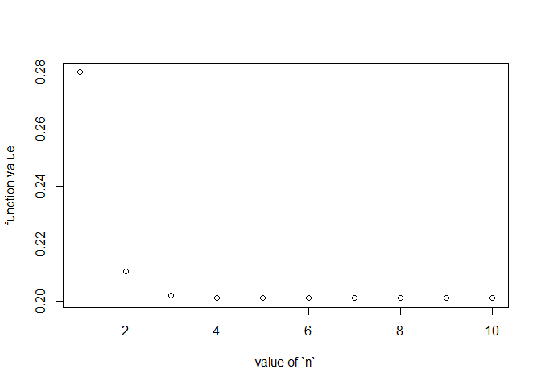

<!-- README.md is generated from README.Rmd. Please edit that file -->

# pruin

<!-- badges: start -->
<!-- badges: end -->

The goal of pruin is to compute ruin probability.

## Installation

You can install the development version of pruin from
[GitHub](https://github.com/) with:

``` r
# install.packages("devtools")
devtools::install_github("haydo1117/pruin")
```

R version 4.1+ is required.

## Example

### Computation of finite ruin probability for Poisson-Exponential process

Run `?ruin_prob_exp` for details. `n` is the number of terms used in the
Gaver-Stehfest algorithm. Large `n` results in divergence due to
numerical precision issue. Small `n` does not converge.

``` r
library(pruin)

c <- 1
lambda <- 1
beta <- 1

ruin_prob_exp(u=1,t=1,c,lambda,beta)
```



    #>       n=1       n=2       n=3       n=4       n=5       n=6       n=7       n=8 
    #> 0.3438019 0.2572464 0.2469878 0.2460180 0.2459412 0.2459372 0.2459376 0.2459378 
    #>       n=9      n=10 
    #> 0.2459370 0.2459456

    ## once `n` is chosen, switch off `try_n`
    ruin_prob_exp(u=1,t=1,c,lambda,beta,n=7,try_n=FALSE)
    #> [1] 0.2459376

### Computation of Inverse Laplace Transform in general

Run `?fn_gs` for details.

``` r
library(pruin)

## laplace transform of constant function k
Fconst <- function(x,k)k/x

fn_gs(Fconst,2,n=15,k=2,plot=FALSE)
#>        n=1        n=2        n=3        n=4        n=5        n=6        n=7 
#>   2.000000   2.000000   2.000000   2.000000   2.000000   2.000000   2.000000 
#>        n=8        n=9       n=10       n=11       n=12       n=13       n=14 
#>   2.000000   1.999999   2.000049   2.000179   2.047860   1.981037   3.410230 
#>       n=15 
#> 201.889947
```
